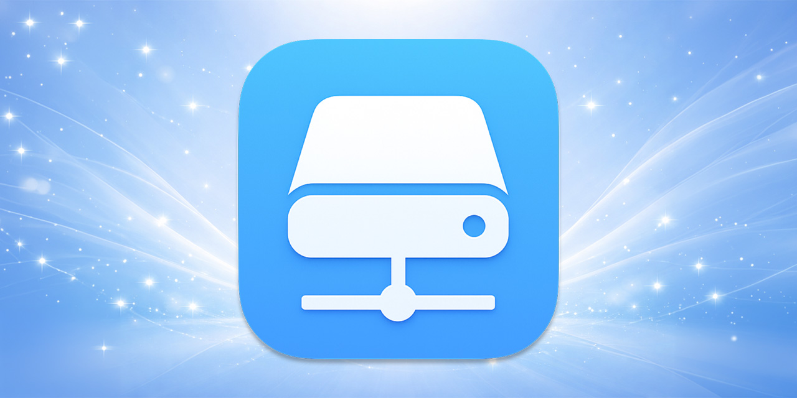
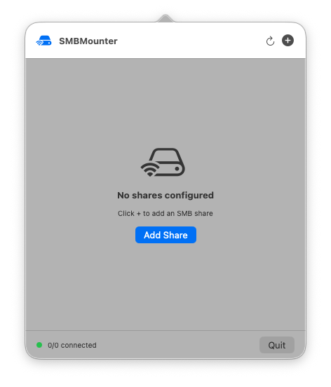
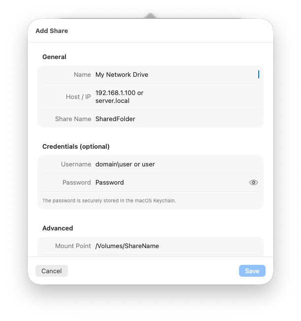
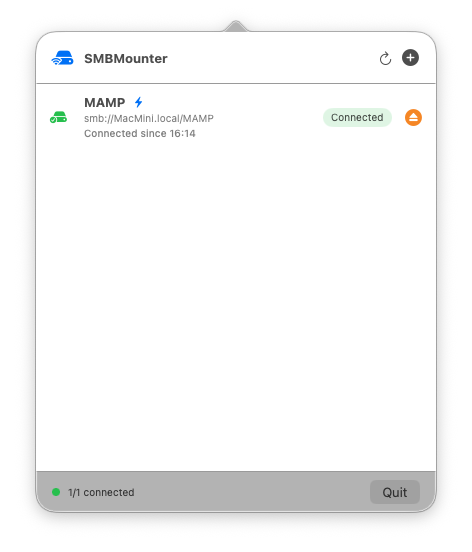

# SMBMounter for macOS

**Automatically mount, reconnect, and manage SMB/WebDAV network drives** – directly from your macOS menu bar.  
Version **1.3** – developed by **Kevin Tobler** 🌐 [www.kevintobler.ch](https://www.kevintobler.ch)

---

## 🔄 Changelog

### 🆕 Version 1.x
- **1.3**
  - ✅ Fixed mounted-volume detection for share names containing spaces, e.g. `Emby Media`
  - 🔎 Mount status checks now handle percent-encoded remount URLs such as `Emby%20Media`
  - 🔐 Improved SMB/WebDAV credential popup handling by allowing longer interactive Finder mount sessions
  - ⚡ Interactive mount sessions now stop early as soon as the share is detected as mounted
- **1.2**
  - 🌐 Added **WebDAV** support alongside SMB
  - 🔐 WebDAV supports **HTTP/HTTPS** selection with automatic default ports
  - 🔌 Added configurable WebDAV port field for custom NAS/server setups
  - 🧭 WebDAV host handling supports plain hosts like `server.local`
  - 🔁 WebDAV connections use the same preflight, mount verification, disconnect, and auto-reconnect flow as SMB
  - 🧰 Improved menu bar icon fallback for menu bar manager compatibility
- **1.1**
  - 🔧 Reworked mount pipeline for higher reliability (clean preflight -> mount -> verify flow)
  - ⏱ Finder mount now runs with hard timeout handling to prevent hanging mount jobs
  - 🧵 Mount attempts are processed sequentially to avoid race conditions between parallel connects
  - 🌐 Improved host resolution with stable SMB reachability checks and Bonjour/local fallback logic
  - 🔁 Added extra retry passes after a failed/disconnected attempt for better wake/reconnect behavior
  - 🛑 Manual disconnect now cancels pending retry/mount flow for that share more consistently
  - 🙈 No more Finder error popups on mount timeout (timeouts are handled silently in-app)
- **1.0**
  - 💾 Auto-mount saved network shares at login  
  - 🔁 Auto-Reconnect after connection loss or sleep/wake events  
  - 🖥️ Modern SwiftUI menu bar interface with status indicators  
  - 🧭 Protocol support: **SMB**
  - ⚙️ Secure Keychain storage for credentials  

---

## 🚀 Features

- 🧠 **Auto-Reconnect** on network loss or after system sleep  
- 🔒 **Keychain Integration** – credentials are stored securely  
- 🌐 **SMB + WebDAV Support** – mount classic SMB shares and WebDAV targets  
- 🔐 **HTTP/HTTPS WebDAV Options** – choose scheme and custom port per connection  
- 💡 **Status Monitoring** – shows mount state in the menu bar  
- 💾 **Auto-Mount at Login** – keep all shares ready automatically  
- 🧩 **SwiftUI Interface** optimized for macOS Sonoma 14.6+ 
- 🌙 **Sleep/Wake Detection** for stable mounts  

---

## 📸 Screenshots

  
  
  

---

## ⚙️ How It Works

1. Add your **network targets** (SMB or WebDAV)  
2. Credentials are stored securely in the **macOS Keychain**   
3. The **menu bar** shows live status for all connections  

---

## 🔧 Installation

1. Download the latest **SMBMounter.app** release  
2. Move **SMBMounter.app** to your **Applications** folder  
3. Launch the app
4. Add your network drives and credentials  
5. Done — your shares will mount automatically!  

> 🧱 Requires macOS 14.6 Sonoma or newer

---

## 🧑‍💻 Developer

**Kevin Tobler**  
🌐 [www.kevintobler.ch](https://www.kevintobler.ch)  

---

## 📜 License

This project is licensed under the **MIT License** – feel free to use, modify, and distribute.
